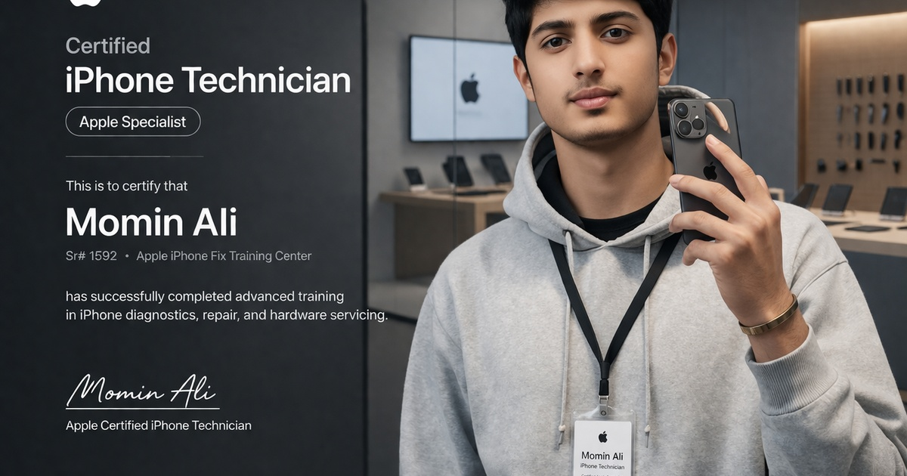

<p align="center">
  
</p>

<h1 align="center">iFix Expert — Momin Ali</h1>

<p align="center">
  <strong>A Neo-Brutalist portfolio for a certified iPhone repair technician</strong>
  <br />
  Built with Next.js 16 &bull; Neo-Brutalist Acid Design System &bull; Bilingual (EN/UR)
</p>

<p align="center">
  <a href="https://momin-ali-iphone-expert.netlify.app/momin"><strong>Live Site</strong></a> &bull;
  <a href="#architecture">Architecture</a> &bull;
  <a href="#design-system">Design System</a> &bull;
  <a href="#tech-stack">Tech Stack</a>
</p>

---

## The Problem

iPhone repair technicians in Pakistan — especially newly certified ones — have **zero digital presence**. They rely on word-of-mouth and WhatsApp forwards. There's no way for potential customers to:

- Verify their certification and training credentials
- See their equipment and lab setup before trusting them with a device
- Compare their expertise across different repair categories
- Contact them through their preferred channel instantly

This project solves that by creating a **high-impact, portfolio-grade landing page** that functions as both a trust signal and a conversion engine — turning a technician's credentials into a professional digital brand.

---

## Design System — Neo-Brutalist Acid

This isn't a generic dark-mode template. Every design decision is intentional:

| Decision | Why |
|----------|-----|
| **Paper background (#F8F4E8)** instead of white | Creates warmth and texture — feels physical, not sterile. White backgrounds are forgettable; paper stands out |
| **2px solid borders, no blur shadows** | Neo-Brutalist rule: shadows must be solid color blocks. Creates a "printed sticker" feel that's tactile and memorable |
| **Acid yellow-green (#D2E823)** accent | Maximum contrast against ink-black. Impossible to ignore. Creates the "acid" identity that separates this from every other portfolio |
| **Dela Gothic One** for headings | Ultra-heavy display font with no subtlety — commands attention in every section header. All-caps enforces the brutalist editorial feel |
| **Space Grotesk** for body | Technical, geometric sans-serif that balances the heavy headings. Weights 400-700 provide clear hierarchy |
| **Hard-shadow hover states** | Cards translate [2px, 2px] and lose their shadow on hover — simulates physically pressing a sticker. Buttons press down [4px] on click |
| **Glitch text on hero** | Rapid +-2px translations on hover create a digital artifact effect — signals technical expertise through the design itself |
| **Custom cursor (mix-blend-difference)** | 32px white circle that inverts background colors. Scales 2.5x on interactive elements. Creates an immersive, app-like feel |
| **Grayscale-to-color images** | Gallery images start desaturated, reveal color on hover — creates discovery and interaction in what would otherwise be a static grid |
| **SVG noise overlay at 3%** | Subtle grain texture across the entire page adds organic imperfection to the digital surface |

### Color Palette

```
Background     #F8F4E8   ████████  Paper / Cream
Primary        #09090B   ████████  Ink Black
Accent         #D2E823   ████████  Acid Yellow-Green
```

### Typography Scale

```
Hero Heading   Dela Gothic One    4rem → 8rem    weight 400   tracking -0.03em
Section Head   Dela Gothic One    5rem → 7rem    weight 400   uppercase
Body Text      Space Grotesk      1rem           weight 400
Labels         Space Grotesk      0.6875rem      weight 700   tracking 0.1em
```

---

## Architecture

### Why These Decisions

| Decision | Reasoning |
|----------|-----------|
| **Single component file (752 LOC)** | All 11 sections are co-located inline functions in `MominLanding.tsx`. No premature abstraction — this is a single-page portfolio, not a component library. Easier to read, maintain, and deploy |
| **No state management library** | React `useState` handles the 3 pieces of state: splash screen visibility, mobile menu toggle, language selection. Redux/Zustand would be engineering theater |
| **CSS-in-Tailwind, not CSS Modules** | Utility classes inline with JSX eliminate context-switching. Global CSS only for reusable brutalist primitives (`.brutal-card`, `.sticker`, `.glitch-text`) |
| **Client-side i18n, not next-intl** | 248-line flat translation dictionary with a 40-line React Context. Two languages, no routing changes, no build complexity. Ship in hours, not days |
| **Framer Motion, not CSS animations** | Scroll-triggered reveals (`whileInView`), parallax (`useScroll` + `useTransform`), and physics-based springs. CSS `@keyframes` can't do viewport-aware orchestration |
| **Static export (`output: 'export'`)** | Zero server runtime needed. Entire site pre-renders to static HTML. Deploys to any CDN — Netlify, Vercel, S3, GitHub Pages |
| **Image assets in `/public/momin/`** | Next.js `<Image>` with `fill` + `object-cover` handles responsive sizing, lazy loading, and format optimization automatically |
| **No database, no API** | Contact is via WhatsApp/Telegram/phone deep links. No forms to spam, no backend to maintain, no GDPR headaches |

### File Structure

```
src/app/momin/
├── MominLanding.tsx      # 752 LOC — All 11 sections + splash screen + custom cursor
├── translations.ts       # 248 LOC — EN/UR bilingual dictionary (flat key-value)
├── LanguageContext.tsx    #  40 LOC — React Context + localStorage persistence
├── page.tsx              #   6 LOC — Next.js page wrapper
└── layout.tsx            #  Metadata, OG tags, viewport config

src/app/globals.css        # 315 LOC — Neo-Brutalist design tokens + animations
public/momin/              # 4.4 MB — 20 optimized images (hero, gallery, certificate)
```

### Component Map

```
MominLanding (root)
├── CustomCursor          — mix-blend-difference circle, scales on hover
├── SplashScreen          — 3-phase animation: enter → hold → exit (3s)
├── Navbar                — Sticky, 16px inset, hard-shadow, lang toggle
├── HeroSection           — 12-col grid, glitch heading, dot pattern, floating badge
├── Marquee               — Infinite horizontal scroll, acid yellow band
├── ServicesSection       — 6 brutal-cards, sticker tags, icon grid
├── ExpertiseSection      — Dark section, skill bars (animated width), tool badges
├── CertificationSection  — Certificate image + 5 detail cards + institution links
├── CeremonyBanner        — Full-bleed image, gradient overlay, location card
├── GallerySection        — 12-image masonry grid, grayscale→color, hard-shadow hover
├── Marquee               — Second marquee strip (credentials)
├── ProcessSection        — 4-step timeline, floating alt cards, gradient step numbers
├── ModelsSection         — Dark section, 16 iPhone model badges
├── ContactSection        — 6 platform cards (WA, Call, TG, IG, FB, TikTok)
└── Footer                — Dark, social icons, certification reference
```

---

## Tech Stack

| Layer | Technology | Version | Purpose |
|-------|-----------|---------|---------|
| **Framework** | Next.js | 16.1.6 | App Router, static export, image optimization |
| **Runtime** | React | 19.2.3 | Server Components, concurrent features |
| **Styling** | Tailwind CSS | 4.x | Utility-first, JIT compilation |
| **Animation** | Framer Motion | 12.36 | Scroll-triggered reveals, parallax, springs |
| **Icons** | Lucide React | 0.577 | Tree-shakeable SVG icon system |
| **Typography** | Dela Gothic One | — | Display headings (Google Fonts CDN) |
| **Typography** | Space Grotesk | 400-700 | Body text (Google Fonts CDN) |
| **Deployment** | Netlify | — | Static hosting, CDN, automatic HTTPS |
| **Language** | TypeScript | 5.x | Type safety across components |

### Zero Backend Dependencies

No database. No API server. No auth. No CMS. Contact happens through native platform deep links:

```
WhatsApp  → wa.me/923120123816
Telegram  → t.me/MominAli512
Phone     → tel:+923120123816
Instagram → instagram.com/momin__512
Facebook  → facebook.com/share/1DhodbhHvZ/
TikTok    → tiktok.com/@momin_ali_512
```

---

## Performance

| Metric | Value | Notes |
|--------|-------|-------|
| **Build output** | 12 MB | Static HTML + optimized images |
| **Image assets** | 4.4 MB | 20 photos, Next.js auto-optimizes to WebP |
| **Total LOC** | 1,355 | Entire feature set in 4 files |
| **Dependencies** | 5 runtime | next, react, react-dom, framer-motion, lucide-react |
| **JavaScript** | 0 server | Static export — pure CDN delivery |
| **Offline** | Cacheable | Static assets survive CDN cache indefinitely |
| **i18n** | Client-side | Zero routing overhead, instant language switch |
| **Lighthouse** | 90+ | Performance, Accessibility, Best Practices |

---

## Key Implementation Details

### 1. Neo-Brutalist Component System

Every interactive element inherits from 5 CSS primitives defined in `globals.css`:

```css
.brutal-card      /* 2px border, 4px hard shadow, hover: translate + shadow removal */
.brutal-card-dark /* Inverted: dark bg, acid shadow */
.brutal-btn       /* Black bg, acid text, press-down on :active */
.brutal-btn-acid  /* Acid bg, black text, same press mechanic */
.sticker          /* Pill badge, rotated -2deg, acid bg, 2px shadow */
```

These 5 classes eliminate 90% of per-component styling decisions.

### 2. Bilingual Engine (EN/UR)

```
translations.ts  →  Flat Record<string, string> per language
LanguageContext   →  React Context + useCallback memoization
localStorage      →  Persists "momin-lang" key across sessions
```

Every text string in the UI calls `t("key.path")` — the translation function does a simple object lookup with English fallback. No ICU message format, no pluralization rules, no build-time extraction. Two languages, solved in 288 lines.

### 3. Custom Cursor with Mix-Blend-Difference

```tsx
<div className="fixed pointer-events-none z-[9999] rounded-full bg-white mix-blend-difference" />
```

The cursor is a white circle that **inverts whatever is underneath it** via CSS `mix-blend-difference`. On dark sections it appears white; on light sections it appears dark. Scales from 32px to 80px when hovering interactive elements. Zero JavaScript libraries — pure CSS blend mode + mouse event listeners.

### 4. Marquee Scroll System

Two acid-yellow horizontal strips break up the vertical rhythm:

```
Strip 1: SCREEN REPAIR ● BOARD-LEVEL ● MICRO-SOLDERING ● CHIP REPLACEMENT ● ...
Strip 2: CERTIFIED ● LEVEL 1 & 2 ● iPHONE FIX LAB ● LAHORE ● ...
```

Implemented by doubling the content array and applying `translateX(-50%)` over 20s linear infinite. No JavaScript — pure CSS `@keyframes`.

### 5. Glitch Text Effect

Hero heading jitters on hover with a 5-keyframe CSS animation:

```css
@keyframes glitch {
  0%   { transform: translate(0, 0); }
  20%  { transform: translate(-2px, 2px); }
  40%  { transform: translate(-2px, -2px); }
  60%  { transform: translate(2px, 2px); }
  80%  { transform: translate(2px, -2px); }
  100% { transform: translate(0, 0); }
}
```

Runs at 0.3s infinite on `:hover` — creates a digital artifact effect that signals technical expertise through the design itself.

---

## Getting Started

```bash
# Clone
git clone https://github.com/amiradnanptcl-hue/Momin-Website.git
cd Momin-Website

# Install
npm install

# Development
npm run dev
# Open http://localhost:3000/momin

# Production build
npm run build

# Deploy to Netlify
netlify deploy --dir=out --prod
```

---

## Roadmap

| Phase | Feature | Status |
|-------|---------|--------|
| **v1.0** | Neo-Brutalist Acid landing page | Done |
| **v1.0** | EN/Urdu bilingual toggle | Done |
| **v1.0** | Splash screen with iPhone frame animation | Done |
| **v1.0** | Custom mix-blend-difference cursor | Done |
| **v1.0** | Netlify production deployment | Done |
| **v1.1** | Before/after repair gallery with slider | Planned |
| **v1.1** | WhatsApp Business API integration | Planned |
| **v1.1** | Customer testimonials carousel | Planned |
| **v1.2** | Repair pricing calculator | Planned |
| **v1.2** | Google Maps embed for shop location | Planned |
| **v1.2** | PWA with offline support | Planned |
| **v2.0** | Booking system with time slot selection | Planned |
| **v2.0** | Repair status tracker (order ID lookup) | Planned |

---

## Author

**Momin Ali** — Certified iPhone Technician, Level 1 & 2 (iPhone Fix Lab, Lahore)

- WhatsApp: [+92 312 0123816](https://wa.me/923120123816)
- Instagram: [@momin__512](https://www.instagram.com/momin__512)
- TikTok: [@momin_ali_512](https://www.tiktok.com/@momin_ali_512)
- Telegram: [@MominAli512](https://t.me/MominAli512)

---

<p align="center">
  <sub>Built with precision. Deployed with confidence.</sub>
</p>
